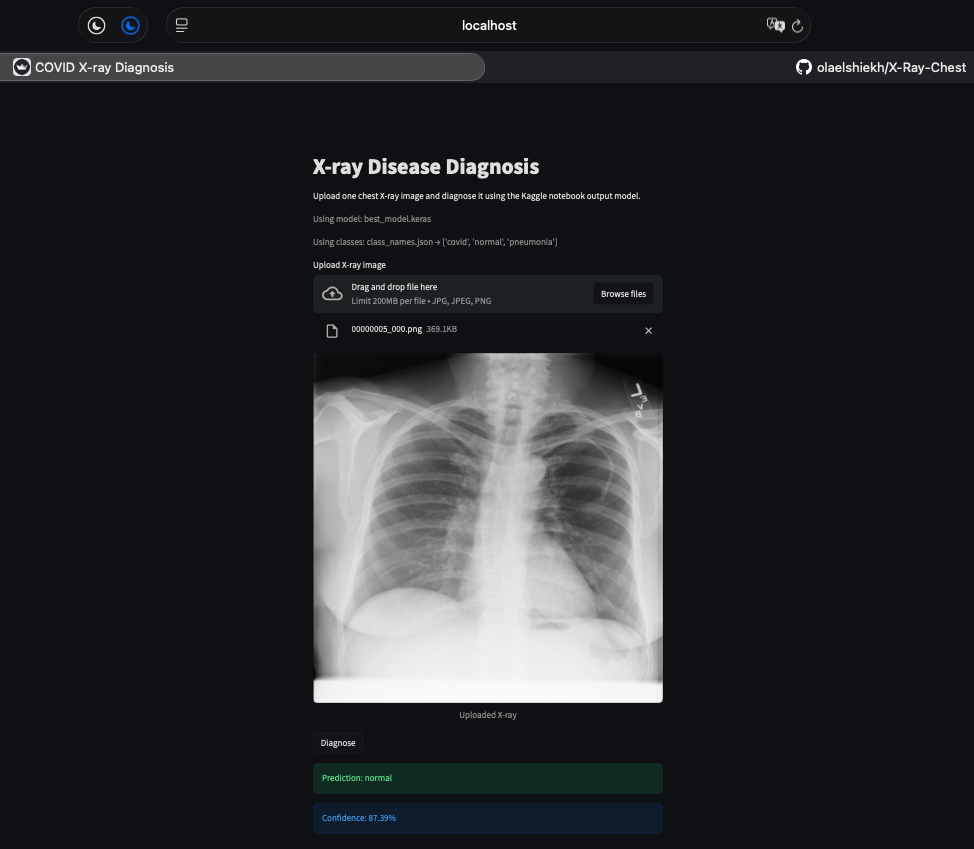

# COVID X-Ray Diagnosis (Streamlit + CNN)

A Streamlit app that classifies uploaded chest X-ray images using a trained CNN model (`best_model.keras`) and displays the predicted class with confidence.

## Project Structure

- `app.py` - Main Streamlit application
- `requirements.txt` - Python dependencies
- `model/` - Model artifacts (`best_model.keras`, `class_names.json`)
- `Cnn_streamlit.png` - App screenshot

## App Preview

This screenshot verifies the final project view:



## Requirements

- Python 3.11+
- Kaggle API access (if model artifacts are not already present locally)

## Installation

```bash
python -m venv .venv
source .venv/bin/activate
pip install -r requirements.txt
```

## Environment Variables

Create a `.env` file in the project root and add one of the following:

1. Recommended token mode:

```env
KAGGLE_API_TOKEN=your_token_here
```

2. Legacy username/key mode:

```env
KAGGLE_USERNAME=your_username
KAGGLE_KEY=your_key
```

## Run the App

```bash
streamlit run app.py
```

Then open the local URL provided by Streamlit (usually `http://localhost:8501`).

## Notes

- If `model/best_model.keras` and `model/class_names.json` already exist, the app loads them directly.
- If model files are missing, the app tries to download notebook artifacts from Kaggle using the configured credentials.
